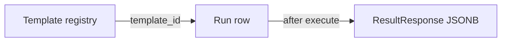

# Ciclo de vida: experimento, run y resultado

**Audiencia:** quien extienda la API, el comparador de runs o los DTOs.  
**Contratos de código:** [`packages/shared-types`](../../packages/shared-types) (TypeScript) y [`app/schemas/common.py`](../../apps/quantum-api/app/schemas/common.py) (Pydantic).  
**Persistencia:** filas en `runs` y `run_results` ([`models.py`](../../apps/quantum-api/app/infrastructure/persistence/models.py)); el payload del resultado es un `ResultResponse` serializado a JSONB.

---

## 1. Plantilla (`Template`) vs `template_id` vs `slug`

| Concepto | Significado hoy |
|----------|-----------------|
| **Template** | Definición de un tipo de experimento: parámetros permitidos, categoría, qué simulación ejecuta el motor (lógica en `template_registry` + `runs.execute`). |
| **`template_id`** | Identificador canónico estable, p. ej. `bell-state`, `ghz-state`. Se guarda en el run, aparece en DTOs y en la URL de API `GET /templates/{id}`. **No es la clave primaria de la fila; el run usa UUID propio.** |
| **`slug`** | Slug de producto/URL, p. ej. en rutas web `/experiments/bell-state`. En el registro actual suele **coincidir** con `template_id`; el backend resuelve plantillas por **id o slug** en `get_template()`. **No** mezclar: si divergen en el futuro, el catálogo web debe enlazar por `slug` y el run sigue llevando `template_id` canónico. |

**Comparación entre runs (diseño):** dos runs son comparables si comparten el mismo `template_id` (y, según reglas de negocio, backend y/o shape de `parameters`); la vista de comparación no debe asumir `slug` en la fila de base de datos.

---

## 2. Estados de un `Run` (`RunStatus`)

Valores: `draft` | `queued` | `running` | `completed` | `failed`.

| Estado | Significado |
|--------|-------------|
| `draft` | Metadatos guardados por `POST /runs`; aún no se ha llamado a `POST /runs/{id}/execute` (no hay `Result` ni estado final). |
| `running` | El executor está en curso (hoy: transición inmediata antes de Qiskit). |
| `completed` | Ejecución OK; existe `ResultResponse` persistido. |
| `failed` | Error en ejecución; `error_message` puede estar rellenado. |
| `queued` | Reservado para colas en el futuro; hoy poco usado. |

**Flujo mínimo actual:** `draft` → `running` → `completed` o `failed`.

**Campos de metadatos del run:** `id` (UUID), `template_id`, `backend`, `shots`, `parameters` (JSON), `created_at`, `updated_at`, `error_message?`.

---

## 3. Qué es un `Result` (`ResultResponse`)

Tras un run **completado**, el producto expone un **resultado** con tres bloques lógicos (mapean a Pydantic/TS 1:1):

1. **`summary`** — Texto legible: titular y detalle opcional (copy de producto / motor).
2. **`metrics`** — Números estructurados para tablas, comparación y “lab” (ver sección 4).
3. **`artifacts`** — Objetos más pesados o serializados: p. ej. histograma, OpenQASM.

**Almacenamiento:** tabla `run_results`, columna `payload` JSONB = serialización de `ResultResponse` completo.

---

## 4. `metrics` y `artifacts` (hero Bell y comparación)

**Experimento hero (Bell state) — contrato mínimo que el motor rellena hoy:**

| Campo | Dónde | Uso en comparación |
|--------|--------|--------------------|
| `qubit_count` | `ResultMetrics` | Comprobar mismo tamaño de circuito vs otro run Bell. |
| `circuit_depth` | `ResultMetrics` | Delta entre runs (mismos parámetros → debería coincidir; si no, investigar transpilación). |
| `gate_counts` | `ResultMetrics` | Comparación detallada por tipo de puerta. |
| `execution_time_ms` | `ResultMetrics` | “Coste” del simulador en la máquina; no QPU. |
| `measurement_distribution` | `ResultArtifacts` | Eje común: `labels` + `counts` + `shots` para alinear dos histogramas. |
| `circuit_qasm` | `ResultArtifacts` | Comprobar que el circuito transpilado coincide entre runs; diff textual opcional. |

**Regla para comparar dos runs en UI/API:** mínimo mismo `template_id`; para Bell, `parameters` vacíos o equivalentes; comparar pares de métricas y superponer o restar conteos por etiqueta cuando `labels` sean el mismo conjunto (orden: ordenación lexicográfica de cadenas, como hace el executor Bell).

**Campos de `summary`:** orientados a copy; no son clave estructural de diff salvo `headline` como etiqueta en listados.

---

## 5. Ruido, backends extra, multi-simulador (futuro)

**Explícitamente fuera del MVP v1** descrito en [`roadmap_mvp.md`](../../roadmap_mvp.md): modelos de **ruido** calibrables, conexión a **hardware** (IBM, etc.) y abstracción amplia de **backends** más allá de `local_simulator` + Qiskit Aer. El campo `backend` en el run reserva el nombre; el executor actual solo acepta el simulador local documentado en código.

---

## 6. Referencia rápida (diagrama)

```mermaid
stateDiagram_v2
  direction LR
  [*] --> draft: POST /runs
  draft --> running: POST .../execute
  running --> completed: set_result + OK
  running --> failed: error
  completed --> [*]
  failed --> [*]
```



---

## 7. API: historial con resultados y comparación (E.4)

**OpenAPI interactivo:** con la API en marcha, `GET http://127.0.0.1:8000/docs` (o el host/puerto que uses) lista todos los esquemas; los modelos viven en [`app/schemas/common.py`](../../apps/quantum-api/app/schemas/common.py) (`RunCompareRequest`, `RunCompareResponse`, `AlignedDistributionsCompare`, `RunWithResultItem`).

Tras desplegar o actualizar código, **reinicia el proceso `uvicorn`** para que `/docs` y el runtime incluyan rutas nuevas (`GET /runs/lab`, `POST /runs/compare`).

### 7.1 `GET /runs/lab` — runs completados con resultado (histograma)

Query obligatoria: `template_id`. Ejemplo:

```http
GET /runs/lab?template_id=bell-state&limit=20
```

Respuesta: array de objetos `{ "run": { ...RunDTO }, "result": { ...ResultDTO } }`. Ejemplo mínimo (truncado):

```json
[
  {
    "run": {
      "id": "550e8400-e29b-41d4-a716-446655440000",
      "template_id": "bell-state",
      "backend": "local_simulator",
      "shots": 1024,
      "parameters": {},
      "status": "completed",
      "created_at": "2026-04-22T12:00:00+00:00",
      "updated_at": "2026-04-22T12:00:01+00:00",
      "error_message": null
    },
    "result": {
      "run_id": "550e8400-e29b-41d4-a716-446655440000",
      "template_id": "bell-state",
      "summary": { "headline": "..." },
      "metrics": { "qubit_count": 2 },
      "artifacts": {
        "measurement_distribution": {
          "labels": ["00", "01", "10", "11"],
          "counts": [512, 0, 0, 512],
          "shots": 1024
        }
      }
    }
  }
]
```

### 7.2 `POST /runs/compare` — dos runs, mismo `template_id`

**Request body:**

```json
{
  "run_id_a": "uuid-del-primer-run",
  "run_id_b": "uuid-del-segundo-run"
}
```

**Respuesta (campos principales):** incluye `run_a`, `run_b`, `result_a`, `result_b`, y `aligned` con etiquetas comunes y conteos alineados:

```json
{
  "run_a": {
    "id": "aaaaaaaa-aaaa-aaaa-aaaa-aaaaaaaaaaaa",
    "template_id": "bell-state",
    "backend": "local_simulator",
    "shots": 256,
    "parameters": {},
    "status": "completed",
    "created_at": "2026-04-22T12:00:00+00:00",
    "updated_at": "2026-04-22T12:00:01+00:00",
    "error_message": null
  },
  "run_b": {
    "id": "bbbbbbbb-bbbb-bbbb-bbbb-bbbbbbbbbbbb",
    "template_id": "bell-state",
    "backend": "local_simulator",
    "shots": 256,
    "parameters": {},
    "status": "completed",
    "created_at": "2026-04-22T12:00:45+00:00",
    "updated_at": "2026-04-22T12:00:46+00:00",
    "error_message": null
  },
  "result_a": {
    "run_id": "aaaaaaaa-aaaa-aaaa-aaaa-aaaaaaaaaaaa",
    "template_id": "bell-state",
    "summary": { "headline": "..." },
    "metrics": {},
    "artifacts": {
      "measurement_distribution": {
        "labels": ["00", "01", "10", "11"],
        "counts": [120, 5, 4, 127],
        "shots": 256
      }
    }
  },
  "result_b": {
    "run_id": "bbbbbbbb-bbbb-bbbb-bbbb-bbbbbbbbbbbb",
    "template_id": "bell-state",
    "summary": { "headline": "..." },
    "metrics": {},
    "artifacts": {
      "measurement_distribution": {
        "labels": ["00", "01", "10", "11"],
        "counts": [118, 6, 6, 126],
        "shots": 256
      }
    }
  },
  "aligned": {
    "labels": ["00", "01", "10", "11"],
    "counts_a": [120, 5, 4, 127],
    "counts_b": [118, 6, 6, 126],
    "shots_a": 256,
    "shots_b": 256,
    "prob_a": [0.46875, 0.01953125, 0.015625, 0.49609375],
    "prob_b": [0.4609375, 0.0234375, 0.0234375, 0.4921875]
  },
  "shots_delta": 0,
  "created_delta_ms": 45000.0
}
```

**Errores HTTP típicos:** `404` (run inexistente), `400` con `compare_requires_same_template_id`, `results_not_ready`, `compare_requires_two_distinct_runs`, o `measurement_distribution_missing` si falta el histograma.
